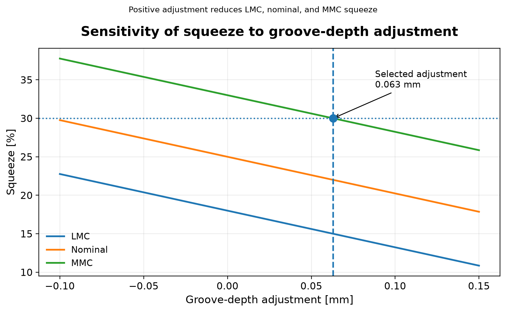
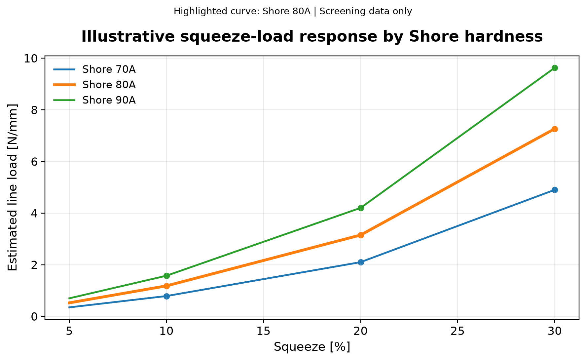
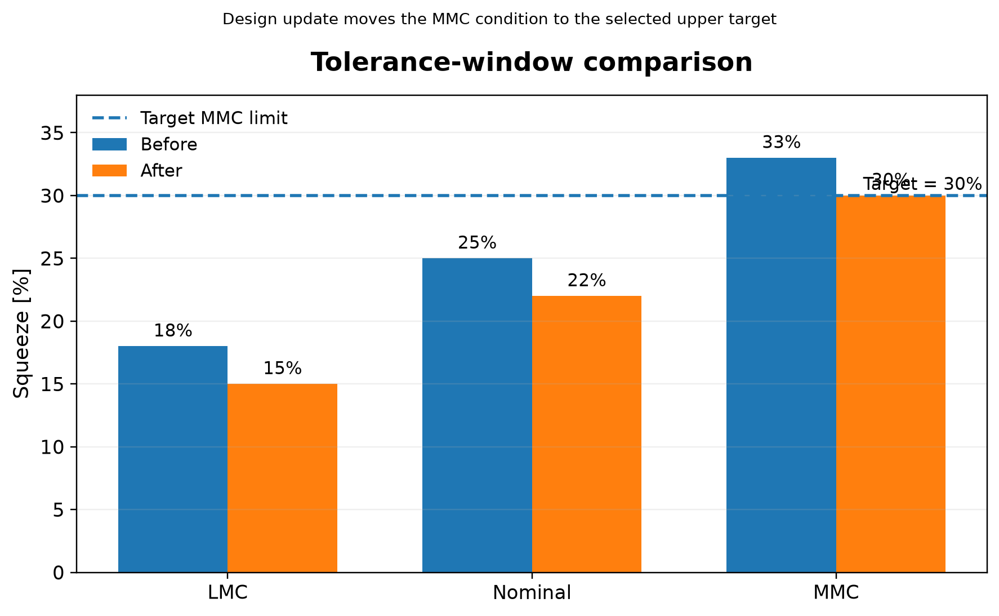
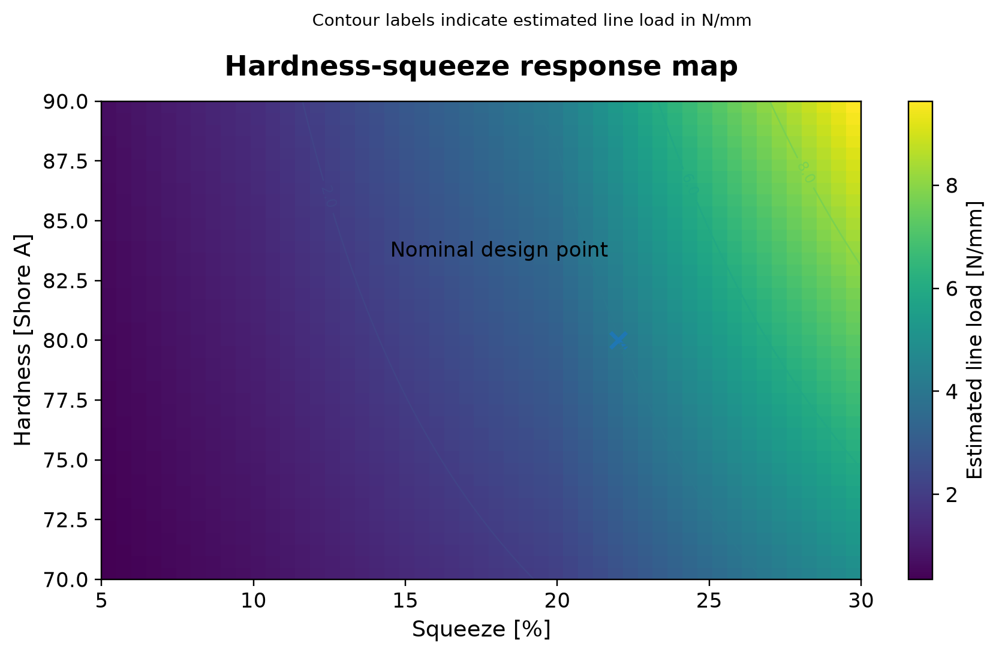
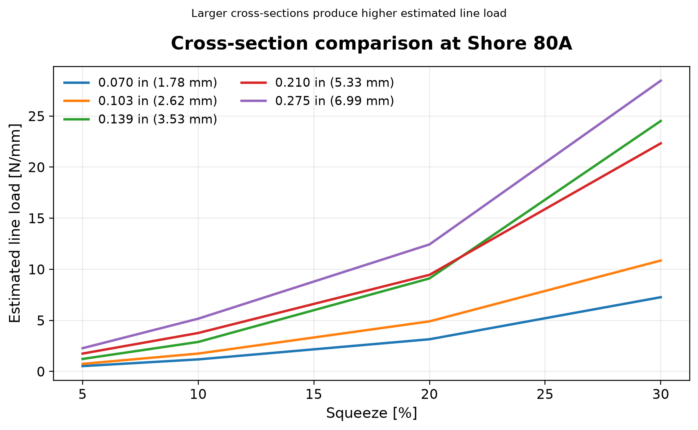
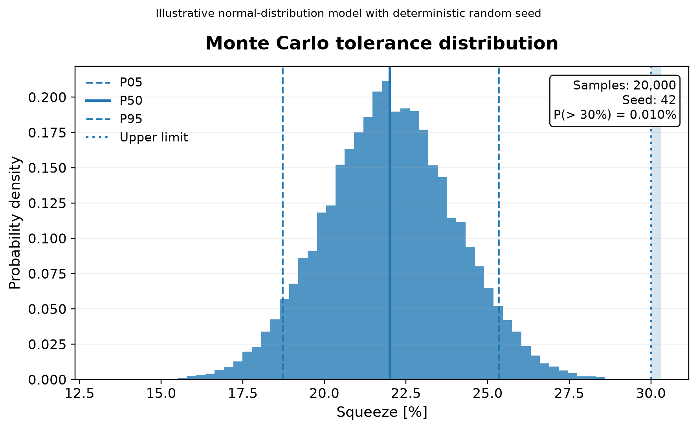

# FEA Structural Automation

[](https://github.com/erickjer0288-droid/fea-structural-automation/actions/workflows/quality.yml)

A sanitized Python engineering toolkit for fast structural and sealing calculations before detailed finite element analysis.

> **Portfolio safety:** this repository excludes proprietary geometry, client names, internal reports, and private source curves. Included curve values are illustrative and must not be used for production release.

## Why this project exists

Detailed nonlinear contact analysis is valuable, but early engineering decisions often need a transparent first-pass model. This project turns a personal O-ring squeeze quick-screen into a typed, tested, installable Python package with traceable assumptions, uncertainty analysis, and explicit limitations.

## Advanced visual case study

The included case study investigates how groove depth, Shore hardness, cross-section, and dimensional variation influence an illustrative O-ring squeeze design. The baseline window is adjusted to meet a 30% MMC target, then evaluated with deterministic sensitivity studies and a seeded Monte Carlo simulation.

<p align="center">
  
</p>

### Design responses

The screening model compares the estimated line-load response by hardness and shows how the tolerance window changes after the groove-depth adjustment.

<table>
<tr>
<td width="50%"></td>
<td width="50%"></td>
</tr>
</table>

### Advanced parameter exploration

The hardness–squeeze response map identifies the nominal design point, while the cross-section comparison demonstrates how section size changes the estimated line load.

<table>
<tr>
<td width="50%"></td>
<td width="50%"></td>
</tr>
</table>

### Tolerance uncertainty

The Monte Carlo model uses 20,000 samples and a deterministic seed to report P05, P50, P95, and the probability of exceeding the illustrative upper squeeze limit.

<p align="center">
  
</p>

All distributions, limits, and response curves in this case study are illustrative. Read the full assumptions and interpretation in [`docs/case-study-oring-squeeze.md`](docs/case-study-oring-squeeze.md).

## Current capability

The workflow evaluates an MMC-driven squeeze target and reports:

- updated LMC, nominal, and MMC squeeze;
- approximate groove-depth adjustment;
- nearest available illustrative cross-section;
- nominal line-load estimate across squeeze and Shore A;
- lbf/in and N/mm results;
- flags when interpolation inputs are clamped or approximated;
- squeeze-load plots, heatmaps, and section comparisons;
- reproducible Monte Carlo tolerance statistics.

## Engineering workflow

```text
Design inputs
    |
    v
Input validation
    |
    v
MMC-driven squeeze update
    |
    v
Cross-section curve selection
    |
    v
Squeeze interpolation + Shore interpolation
    |
    v
Sensitivity and Monte Carlo analysis
    |
    v
Screening result, figures, and traceability flags
    |
    v
Decision: refine geometry, obtain approved data, or proceed to FEA
```

## Installation

```bash
python -m venv .venv
source .venv/bin/activate        # Windows: .venv\Scripts\activate
python -m pip install --upgrade pip
pip install -e .
```

For development tools:

```bash
pip install -e .[dev]
```

## Command-line example

```bash
fea-oring-screen \
  --cross-section-mm 1.78 \
  --shore-a 80 \
  --target-mmc 30
```

## Python API

```python
from fea_structural_automation import OringStudy, evaluate_oring_study

study = OringStudy(
    cross_section_mm=1.78,
    shore_a=80.0,
    target_mmc_percent=30.0,
)
result = evaluate_oring_study(study)

print(result.squeeze)
print(result.nominal_line_load_n_per_mm)
```

## Reproduce the complete case study

```bash
python examples/advanced_case_study.py
```

The script writes six publication-ready PNG figures to:

```text
results/advanced_case_study/
```

GitHub Actions runs the same script on Python 3.12 and publishes the figures as a downloadable workflow artifact.

## Repository structure

```text
src/fea_structural_automation/
├── cli.py             Command-line interface
├── curves.py          Explicitly illustrative screening curves
├── interpolation.py   Dependency-free interpolation utilities
├── models.py          Typed input and result models
├── plotting.py        Publication-ready engineering visualizations
├── squeeze.py         Engineering calculation engine
├── uncertainty.py     Seeded Monte Carlo tolerance model
└── units.py           Unit conversions

tests/                 Unit tests and reproducibility checks
docs/                  Methodology, case study, and committed figures
examples/              Minimal and advanced executable examples
.github/workflows/      Automated lint, typing, tests, and figure generation
```

## Quality controls

Every pull request runs:

- Ruff linting;
- strict MyPy checks on the package;
- Pytest with coverage;
- Python 3.10, 3.11, and 3.12 compatibility checks;
- automatic generation and artifact upload of all six case-study figures.

Run the same checks locally:

```bash
ruff check .
mypy src
pytest
python examples/advanced_case_study.py
```

## Engineering limitations

This package is an early-stage screening tool. It does not model nonlinear elastomer material response, frictional contact, thermal effects, aging, compression set, pressure energization, gland fill, stretch, or validated production tolerance distributions. The nearest illustrative cross-section is selected and squeeze requests outside the curve domain are clamped.

Read the detailed methodology in [`docs/methodology.md`](docs/methodology.md).

## Roadmap

- Approved CSV curve import with metadata and units.
- Correlated and non-normal tolerance distributions.
- Automated engineering report generation.
- Comparison against a generic nonlinear contact FEA model.
- GitHub Pages documentation and versioned releases.

## License

MIT License. See [`LICENSE`](LICENSE).

## Resumen en español

Este repositorio transforma un cálculo preliminar de squeeze de O-ring en una herramienta Python profesional, reutilizable y verificable. Incluye sensibilidad geométrica, mapas de respuesta, comparación de secciones y una simulación Monte Carlo reproducible. Todos los datos públicos son ilustrativos; cualquier aplicación real requiere datos aprobados, validación física y revisión de ingeniería.
